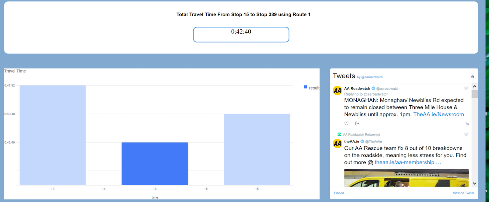
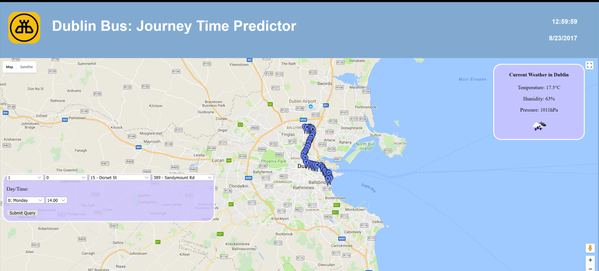
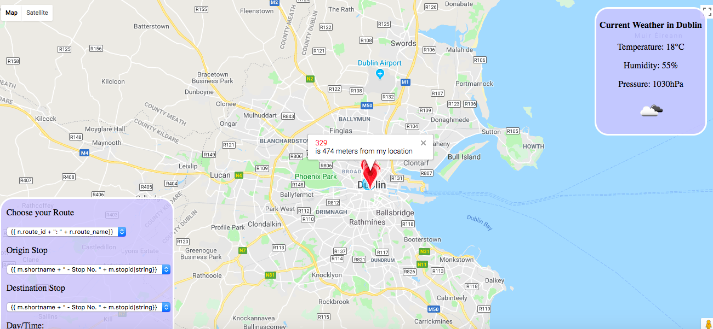

# Dulin-Bus-Application is a group project.
The folder named dbus is my own work code. My resposibilities were that:
  1. Analyzed historical data to select a model to perdict dublin bus arrival time for each route
    
  
  2. Worked on displaying location and found around location 500m all stopID
  
     
  3. Showed all StopID informaiton once clicking on stopID sign on Google map
  
  
  

  

 The following is group 2 GitHub address:

   https://github.com/DavyShawFTL/Summer-Project

In the folder named files on Server/FlaskApp, there are the all project code.
